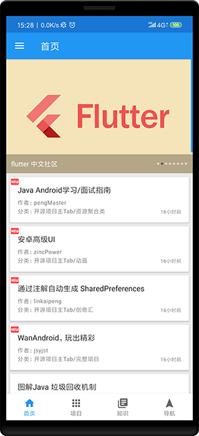
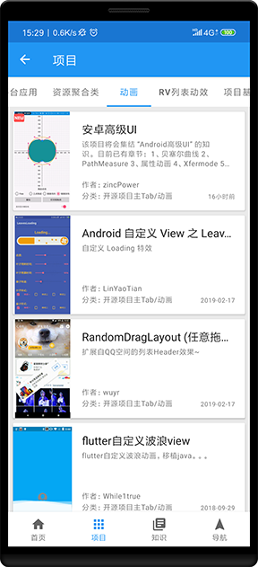
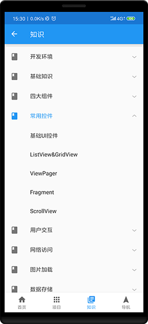

WanAndroid
==========
[玩Android 开放API](https://www.wanandroid.com/blog/show/2)

根据 Google 新推荐的 MVVM 应用架构模式进行开发，使用了 Kotlin + Retrofit + Jetpack( DataBinding, LiveData, ViewModel, Navigation, Paging ) 等技术

截图
---

相关
---
- [Android Jetpack](https://developer.android.google.cn/jetpack)
- [Retrofit](http://square.github.io/retrofit/)
- [ViewPager2](https://github.com/googlesamples/android-viewpager2)
